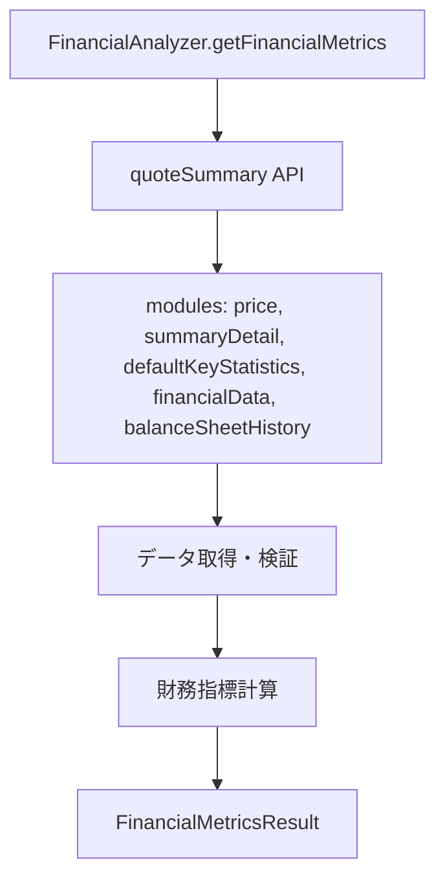
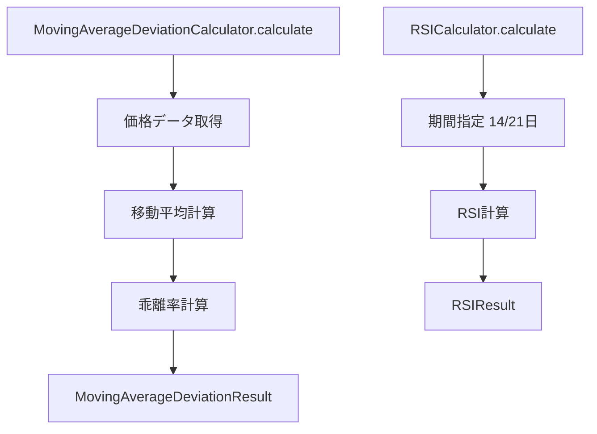

# 財務指標拡張機能 - 設計書

## 1. アーキテクチャ概要

### 1.1 システム構成
```
src/lib/technical-indicators/
├── financial-indicators/          # 新規追加
│   ├── index.ts                  # エクスポート統合
│   ├── FinancialAnalyzer.ts      # 財務指標統合クラス
│   ├── MovingAverageDeviationCalculator.ts  # 移動平均乖離率
│   └── types.ts                  # 財務指標用型定義
├── calculators/
│   └── RSICalculator.ts          # 期間拡張対応 (既存)
└── index.ts                      # メインエクスポート（更新）
```

### 1.2 既存システムとの統合
- **既存のテクニカル指標ライブラリ**を拡張
- **TechnicalAnalyzer**クラスと連携
- **Yahoo Finance API**の`quoteSummary`を活用

## 2. データフロー設計

### 2.1 財務指標取得フロー


### 2.2 テクニカル指標拡張フロー


## 3. データ構造設計

### 3.1 財務指標データ型
```typescript
// 財務指標結果型
export interface FinancialMetricsResult {
  symbol: string;
  companyName?: string;
  marketCap?: number;               // 時価総額
  trailingPE?: number;              // PER（実績）
  forwardPE?: number;               // PER（予想）
  priceToBook?: number;             // PBR
  returnOnEquity?: number;          // ROE
  earningsGrowth?: number;          // EPS成長率
  dividendYield?: number;           // 配当利回り（%変換済み）
  equityRatio?: number;             // 自己資本比率（計算）
  lastUpdated: string;
  dataSource: 'yahoo-finance';
}

// 移動平均乖離率結果型
export interface MovingAverageDeviationResult {
  period: number;                   // 期間（25, 50, 200）
  currentPrice: number;
  movingAverage: number;
  deviation: number;                // 乖離率（%）
  deviationDirection: 'positive' | 'negative';
}

// RSI拡張結果型
export interface RSIExtendedResult {
  rsi14: number;                    // 14日RSI
  rsi21: number;                    // 21日RSI
  signal14: 'overbought' | 'oversold' | 'neutral';
  signal21: 'overbought' | 'oversold' | 'neutral';
}
```

### 3.2 quoteSummaryで使用するモジュール
```typescript
const FINANCIAL_MODULES = [
  'price',                    // 時価総額
  'summaryDetail',           // PER実績、配当利回り
  'defaultKeyStatistics',    // PER予想、PBR
  'financialData',          // ROE、EPS成長率
  'balanceSheetHistory'     // 自己資本比率計算用
] as const;
```

## 4. クラス設計

### 4.1 FinancialAnalyzer（財務指標統合クラス）
```typescript
export class FinancialAnalyzer {
  /**
   * 財務指標を取得
   */
  static async getFinancialMetrics(symbol: string): Promise<FinancialMetricsResult>
  
  /**
   * 自己資本比率を計算
   */
  private static calculateEquityRatio(balanceSheet: any): number | undefined
  
  /**
   * エラーハンドリング
   */
  private static handleQuoteSummaryError(error: any): void
}
```

### 4.2 MovingAverageDeviationCalculator（移動平均乖離率）
```typescript
export class MovingAverageDeviationCalculator {
  /**
   * 移動平均乖離率を計算
   */
  static calculate(prices: number[], period: number): MovingAverageDeviationResult
  
  /**
   * 複数期間の乖離率を一括計算
   */
  static calculateMultiple(
    prices: number[], 
    periods: number[]
  ): MovingAverageDeviationResult[]
  
  /**
   * 乖離率シグナル判定
   */
  static getDeviationSignal(deviation: number): 'strong_above' | 'above' | 'neutral' | 'below' | 'strong_below'
}
```

### 4.3 RSICalculator拡張
既存のRSICalculatorに以下メソッドを追加：
```typescript
export class RSICalculator {
  // 既存メソッドは保持
  
  /**
   * 複数期間RSIを計算
   */
  static calculateMultiple(prices: number[], periods: number[]): { [period: number]: number }
  
  /**
   * RSI拡張結果（14日・21日）を取得
   */
  static calculateExtended(prices: number[]): RSIExtendedResult
}
```

## 5. エラーハンドリング設計

### 5.1 財務指標取得エラー
```typescript
export class FinancialDataError extends Error {
  constructor(
    message: string,
    public symbol: string,
    public errorType: 'api_error' | 'data_missing' | 'calculation_error'
  ) {
    super(message);
  }
}
```

### 5.2 エラー処理方針
- **APIエラー**: Yahoo Financeの制限・認証エラー
- **データ欠損**: 指標データが存在しない場合
- **計算エラー**: 自己資本比率計算時の無効な値

## 6. spike_all_features.ts統合設計

### 6.1 テスト関数の拡張
```typescript
// 新規追加関数
async function testFinancialMetrics(symbol: string): Promise<void>
async function testMovingAverageDeviation(priceData: PriceData[]): Promise<void>
async function testRSIExtended(priceData: PriceData[]): Promise<void>

// 既存関数の更新
async function testBasicIndicators(priceData: PriceData[], closePrices: number[]): Promise<void>
// → RSI拡張テストを追加
```

### 6.2 出力フォーマット
```typescript
// 財務指標出力例
console.log("💰 **財務指標**");
console.log("-".repeat(50));
console.log(`  時価総額: ${result.marketCap?.toLocaleString()}円`);
console.log(`  PER（実績）: ${result.trailingPE?.toFixed(2)}`);
console.log(`  PER（予想）: ${result.forwardPE?.toFixed(2)}`);
console.log(`  PBR: ${result.priceToBook?.toFixed(2)}`);
console.log(`  ROE: ${result.returnOnEquity ? (result.returnOnEquity * 100).toFixed(2) + "%" : "N/A"}`);
console.log(`  配当利回り: ${result.dividendYield?.toFixed(2)}%`);
console.log(`  自己資本比率: ${result.equityRatio?.toFixed(1)}%`);

// 移動平均乖離率出力例
console.log("📊 **移動平均乖離率**");
[25, 50, 200].forEach(period => {
  const deviation = MovingAverageDeviationCalculator.calculate(closePrices, period);
  console.log(`  ${period}日: ${deviation.deviation > 0 ? "+" : ""}${deviation.deviation.toFixed(2)}%`);
});
```

## 7. パフォーマンス設計

### 7.1 API呼び出し最適化
- **一括取得**: quoteSummaryで必要なmoduleを一度に取得
- **キャッシュ戦略**: 同一銘柄の重複リクエスト回避（将来的）
- **タイムアウト**: 5秒でタイムアウト設定

### 7.2 計算処理最適化
- **並列処理**: 移動平均乖離率の複数期間計算
- **メモ化**: 移動平均値の再利用
- **数値精度**: 適切な小数点以下桁数制限

## 8. テスト設計

### 8.1 ユニットテスト
```typescript
// tests/financial-indicators/
├── FinancialAnalyzer.test.ts
├── MovingAverageDeviationCalculator.test.ts
└── RSICalculator.extended.test.ts
```

### 8.2 テストケース
- **正常系**: 各指標の正確な計算
- **異常系**: APIエラー、データ欠損時の処理
- **境界値**: 極端な値での動作確認

## 9. 型安全性設計

### 9.1 TypeScript厳密型チェック
- **Optional Chaining**: APIレスポンスの安全なアクセス
- **Type Guards**: ランタイム型チェック
- **Union Types**: シグナル判定の型安全性

### 9.2 API型定義
```typescript
// Yahoo Finance API レスポンス型
interface QuoteSummaryResult {
  price?: {
    marketCap?: number;
  };
  summaryDetail?: {
    trailingPE?: number;
    dividendYield?: number;
  };
  defaultKeyStatistics?: {
    forwardPE?: number;
    priceToBook?: number;
  };
  financialData?: {
    returnOnEquity?: number;
    earningsGrowth?: number;
  };
  balanceSheetHistory?: {
    balanceSheetStatements?: Array<{
      totalStockholderEquity?: number;
      totalAssets?: number;
    }>;
  };
}
```

## 10. 今後の拡張性設計

### 10.1 新指標追加のためのインターフェース
```typescript
export interface FinancialCalculator<T> {
  calculate(data: any): T;
  getSignal?(result: T): string;
}
```

### 10.2 設定可能なパラメータ
- **移動平均期間**: デフォルト[25, 50, 200]、カスタマイズ可能
- **RSI期間**: デフォルト[14, 21]、カスタマイズ可能  
- **API timeout**: デフォルト5秒、設定可能

この設計により、既存システムとの整合性を保ちながら、新しい財務指標機能を効率的に追加できます。