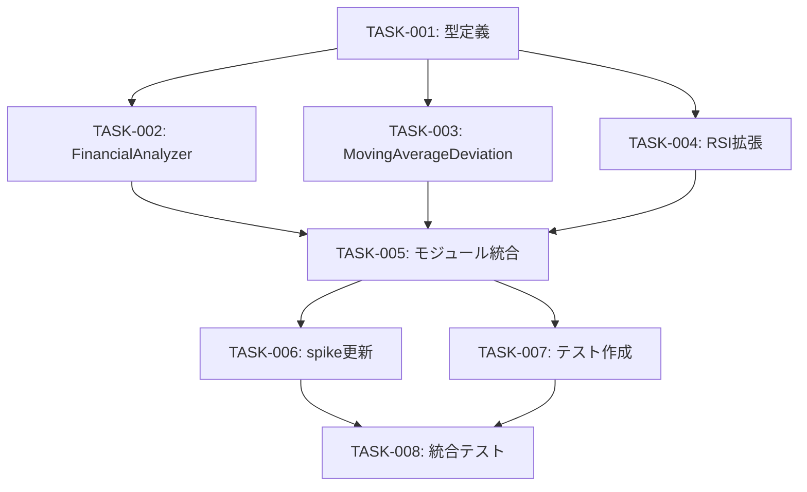

# 財務指標拡張機能 - タスク一覧

## 実装タスク概要

このfeatureでは以下のタスクを順次実装します：

| タスクID | タスク名 | 優先度 | 推定工数 | 状態 |
|----------|----------|--------|----------|------|
| TASK-001 | 財務指標型定義の作成 | High | 1h | ⏳ Pending |
| TASK-002 | FinancialAnalyzerクラスの実装 | High | 3h | ⏳ Pending |
| TASK-003 | MovingAverageDeviationCalculatorの実装 | High | 2h | ⏳ Pending |
| TASK-004 | RSICalculatorの拡張 | Medium | 1h | ⏳ Pending |
| TASK-005 | financial-indicatorsモジュール統合 | Medium | 1h | ⏳ Pending |
| TASK-006 | spike_all_features.tsの更新 | High | 2h | ⏳ Pending |
| TASK-007 | ユニットテストの作成 | High | 3h | ⏳ Pending |
| TASK-008 | 統合テストとデバッグ | Medium | 2h | ⏳ Pending |

**総推定工数**: 15時間

## 詳細タスク説明

### TASK-001: 財務指標型定義の作成
**ファイル**: `src/lib/technical-indicators/financial-indicators/types.ts`
- FinancialMetricsResult型の定義
- MovingAverageDeviationResult型の定義
- RSIExtendedResult型の定義
- エラークラス（FinancialDataError）の定義
- Yahoo Finance API型定義

### TASK-002: FinancialAnalyzerクラスの実装
**ファイル**: `src/lib/technical-indicators/financial-indicators/FinancialAnalyzer.ts`
- quoteSummary API呼び出し実装
- 財務指標データ変換ロジック
- 自己資本比率計算メソッド
- エラーハンドリング実装

### TASK-003: MovingAverageDeviationCalculatorの実装
**ファイル**: `src/lib/technical-indicators/financial-indicators/MovingAverageDeviationCalculator.ts`
- 移動平均乖離率計算メソッド
- 複数期間一括計算メソッド
- 乖離率シグナル判定ロジック
- 既存MovingAverageCalculatorとの連携

### TASK-004: RSICalculatorの拡張
**ファイル**: `src/lib/technical-indicators/calculators/RSICalculator.ts`
- calculateMultipleメソッドの追加
- calculateExtendedメソッドの追加
- 既存メソッドとの互換性維持

### TASK-005: financial-indicatorsモジュール統合
**ファイル**: `src/lib/technical-indicators/financial-indicators/index.ts`
- 各クラスのエクスポート統合
- メインindex.tsへのエクスポート追加
- 型定義の統合エクスポート

### TASK-006: spike_all_features.tsの更新
**ファイル**: `spike/spike_all_features.ts`
- testFinancialMetrics関数の追加
- testMovingAverageDeviation関数の追加
- testRSIExtended関数の追加
- 既存testBasicIndicators関数の拡張
- 日本語出力フォーマットの実装

### TASK-007: ユニットテストの作成
**ファイル群**: `tests/financial-indicators/`
- FinancialAnalyzer.test.ts
- MovingAverageDeviationCalculator.test.ts
- RSICalculator.extended.test.ts
- 正常系・異常系・境界値テスト

### TASK-008: 統合テストとデバッグ
- 実際の銘柄データでの動作確認
- エラーケースの検証
- パフォーマンステスト
- ドキュメントの最終確認

## 依存関係

## 実装順序

1. **Phase 1** (基盤): TASK-001 → TASK-002, TASK-003, TASK-004 (並行実装可能)
2. **Phase 2** (統合): TASK-005 → TASK-006
3. **Phase 3** (検証): TASK-007 → TASK-008

## 品質基準

### コード品質
- TypeScript厳密型チェック通過
- Biome linter・formatter通過
- 既存テスト全て通過

### 機能品質
- 8つの財務指標が正確に取得できる
- 移動平均乖離率が正確に計算される
- RSI(14日/21日)が正確に計算される
- エラーハンドリングが適切に動作する

### パフォーマンス品質
- API呼び出し1回で全財務指標取得
- 計算処理が5秒以内で完了
- メモリ使用量が適切な範囲内

## リスク管理

### 高リスク項目
- **Yahoo Finance API制限**: 認証エラーやレート制限
- **データ欠損**: 企業によって取得できない指標
- **計算精度**: 自己資本比率計算の精度

### 対応策
- 適切なエラーハンドリング実装
- フォールバック処理の実装
- 十分なテストケースでの検証

## 完了基準

以下全ての条件を満たした時点でfeature完了とする：

- [ ] 全8タスクが完了している
- [ ] 全テストが通過している
- [ ] npm run lint, npm run typecheck が通過している
- [ ] spike_all_features.tsで全指標が正常に出力される
- [ ] 実銘柄での動作確認が完了している
- [ ] ドキュメントが最新に更新されている